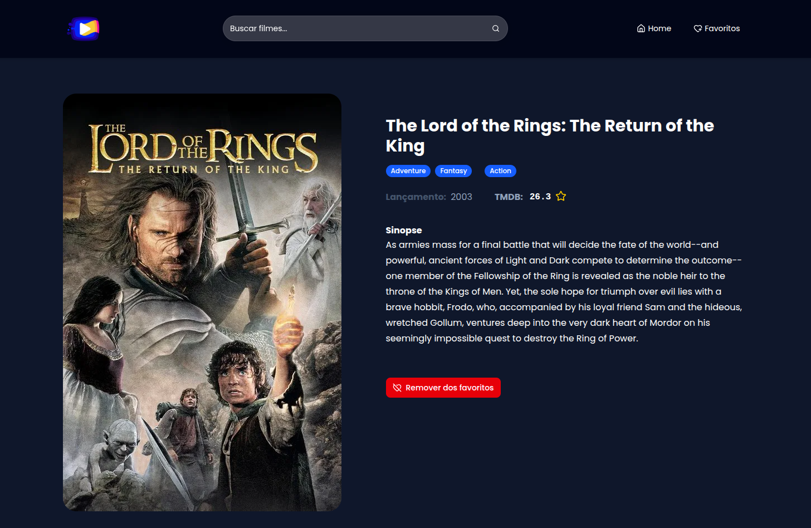

<a name="top"></a>

<div align="center">
  <a href="https://streamovie-psi.vercel.app">
    
  </a>
  <strong align="">Streamovie<strong/>
</div>

<h5 align="center">
  🎬 Streamovie, an application to explore movies, create favorites lists, and discover new content via TMDB API.
</h5>

<p align="center" style="font-size: 12px;">
  <a href="#-techs-flying_saucer">🛸 Techs</a>&nbsp;&nbsp;&nbsp;&nbsp;|&nbsp;&nbsp;&nbsp;
  <a href="#-prerequisites-warning" style="font-size: 12px;">⚠️ Prerequisites</a>&nbsp;&nbsp;&nbsp;&nbsp;|&nbsp;&nbsp;
  <a href="#-how-to-use-grey_question" style="font-size: 12px;">❔ How To Use</a>&nbsp;&nbsp;&nbsp;&nbsp;|&nbsp;&nbsp;&nbsp;
  <a href="#-badges-bookmark" style="font-size: 12px;">🔖 Badges</a>&nbsp;&nbsp;&nbsp;&nbsp;|&nbsp;&nbsp;&nbsp;
  <a href="#-license-closed_lock_with_key" style="font-size: 12px;">🔐 License</a>&nbsp;&nbsp;&nbsp;&nbsp;|&nbsp;&nbsp;&nbsp;
  <a href="#-contact-me-phone" style="font-size: 12px;">☎ Contact Me</a>

  
  🅾️🅾️🅾️🅾️🅾️🅾️🅾️🅾️
  
  
  <a href="#-Roadmap" style="font-size: 12px;">💎 Roadmap</a>
  <span>&nbsp;|&nbsp;<span/>
  <a href="#-prerequisites-warning" style="font-size: 12px;">⚠️ Prerequisites</a>         
  <span>&nbsp;|&nbsp;<span/>
  <a href="#-how-to-use-grey_question" style="font-size: 12px;">❔ How To Use</a>
  <!-- <span>|<span/> -->
  <a href="#-Project-Architecture" style="font-size: 12px;">⚠️ Prerequisites</a>&nbsp;&nbsp;&nbsp;&nbsp;|&nbsp;&nbsp;
  <a href="#-prerequisites-warning" style="font-size: 12px;">⚠️ Prerequisites</a>&nbsp;&nbsp;&nbsp;&nbsp;|&nbsp;&nbsp;
</p>

<br><br><br>

<p align="center">
  
</p>

<br><br>

#### Roadmap [🔝](#top)

- [x] Base structure with React + Vite + TypeScript  
- [x] Explore popular movies from the TMDB API
- [x] Movie listing, search, and favorite functionality
- [x] Create custom favorite lists
- [x] Routing and navigation with React Router
- [x] Global state management with Redux Toolkit
- [x] Full responsiveness with Tailwind CSS
- [x] Error handling and loading states
- [x] Clean code organization and architecture
- [x] Unit testing with Vitest and Testing Library
- [x] Production deployment

<br />

<!-- ## [🔝](#top) Prerequisites :warning: -->
<strong style="font-size: 18px;">📂 Pages structure<a href="#top" name="roadmap" style="font-size: 18px;">🔝</a></strong>

###### 🏠 Home (`/`)
<details open> <summary>Collapsible 🕹️<sup>🤏</sup></summary>

- Fixed header with logo, global search bar, and navigation menu
- Responsive grid displaying popular movies
- Paginated movie listing
- Each movie card displays:
  - Title
  - Poster (`https://image.tmdb.org/t/p/w300/{poster_path}`)  
  - TMDB rating
  - Favorite icon
  
</details>

###### 🎞️ Move details (`/movie/:id`)
<details open> <summary>Collapsible 🕹️<sup>🤏</sup></summary>

- Large image on the left and content on the right
- Displays title, genres, release date, rating, and synopsis
- Button to add or remove from favorites

</details>

###### ❤️ Favorites (`/favorites`)
<details open> <summary>Collapsible 🕹️<sup>🤏</sup></summary>

- Grid layout similar to the Home page
- List of favorited movies
- Trash icon to remove a movie from favorites
- Sorting filters by:
  - Title (A–Z / Z–A)
  - Rating (↑↓)
- Empty state with image, info message, and call-to-action

</details>

###### 🔍 Search (`/search?q=termo`)
<details open> <summary>Collapsible 🕹️<sup>🤏</sup></summary>

- Synchronized search bar
- Results displayed in a grid layout
- Highlight of the searched term
- Paginated search results

</details>

<br/>

## [🔝](#top) Project Architecture
<strong style="font-size: 18px;">🏗️ Project Architecture<a href="#top" name="roadmap" style="font-size: 18px;">🔝</a></strong>

```
/src
  /assets
  /components
    /ui
    /layout
  /config
  /features
    /home
    /movieDetails
    /favorites
    /pageNotFound
    /search
  /routes
  /services
  /stores
  /tests
  /types
  /utils
```

<br/>

<strong style="font-size: 18px;">🛸 Techs<a href="#top" name="technologies" style="font-size: 18px;">🔝</a></strong>

This project was developed with the following technologies:

| dependencies | Description |
|-------------|------------|
| [Vite](https://vitejs.dev) | Fast and optimized bundler |
| [React 19](https://reactjs.org/) | Tha main library of the application |
| [Redux Toolkit](https://redux-toolkit.js.org/) | Global state management |
| [React Router DOM](https://reactrouter.com/) | Pages routing |
| [ShadCN UI](https://ui.shadcn.com/) | Custom accessible components |
| [Radix UI](https://www.radix-ui.com/) | Accessible components |
| [TailwindCSS](https://tailwindcss.com/) | Easy to style and create responsive app |
| [Embla Carousel](https://www.embla-carousel.com/) | Lib to handle carousel application |
| [React Hook Form](https://react-hook-form.com/) | Easy to deal with form handler |
| [Lucide React](https://lucide.dev/) | Lightweight and modern icons |
| [Axios](https://axios-http.com/) | To make API HTTP request |
| [TMDB API](https://developer.themoviedb.org) | The Movie Database API |
| [Zod](https://zod.dev/) | Data validation |

| devDependencies | Description |
|-------------|------------|
| [TypeScript](https://www.typescriptlang.org/) | Static type to be more readable |
| [Vitest](https://vitest.dev/) + [React Testing Library (RTL)](https://testing-library.com/) | Unit tests |

| Others | Description |
|-------------|------------|
| [VS Code](https://code.visualstudio.com/) with [Biome](https://biomejs.dev) | Visual Studio Code (IDE) with Biome as linter |

<br/>

<strong style="font-size: 18px;">⚙️ API — The Movie Database (TMDB)<a href="#top" name="roadmap" style="font-size: 18px;">🔝</a></strong>

The application consumes the [API do TMDB](https://developers.themoviedb.org/3) to list, search, and display detailed information about movies.
You need to create a free account and generate your own **API Access Token**.

**Main Endpoints:**

| Endpoint | Description |
|-----------|------------|
| `/movie/popular` | List of popular movies |
| `/search/movie?query={termo}` | Movie search |
| `/movie/{id}` | Details of a specific movie |

<br/>

<strong style="font-size: 18px;">⚠️ Prerequisites<a href="#top" name="roadmap" style="font-size: 18px;">🔝</a></strong>

Before running this project locally, you need to have:

- [Git](https://git-scm.com)
- [Node.js](https://nodejs.org/) >= v18
- [Yarn](https://yarnpkg.com/) >= v1.22 or npm >= 8
- Account and API Access Token from TMDB

<br />

Make sure you have a valid TMDB API Access Token and your environment set up.

1. Create a free account: [TMDB](https://www.themoviedb.org/)
2. Generate an API Access Token: [TMDB API](https://www.themoviedb.org/settings/api)
3. Create a `.env` file based on `.env.example` with your API Access Token

###### 🧾 .env.example
```bash
VITE_TMDB_API_ACCESS_TOKEN=your_api_access_token
VITE_TMDB_API_URL=https://api.themoviedb.org/3
```

<br/>

<strong style="font-size: 18px;">❔ How To Use<a href="#top" name="roadmap" style="font-size: 18px;">🔝</a></strong>

_From your `command line` follow these steps..._

###### Clone the repository and start the project locally:
```bash
$ git clone https://github.com/caiohenrique-developer/streamovie
$ cd streamovie
```

###### Install dependencies:
```bash
$ yarn
```

###### ...or (if you prefer npm):
```bash
$ npm install
```

###### Start the development server
```bash
$ yarn dev
```

###### ...or (if you prefer npm):
```bash
$ npm run dev
```

_You'll be able to see the URL http://localhost:{port} on your command line._

_So open them and just enjoy this project! ;)_

#### ⚠️ Atention:
Don't forget to create your .env file based on .env.example

<br/>

🚀 Production URL: https://streamovie-psi.vercel.app/


<br/>

<strong style="font-size: 18px;">🔖 Badges<a href="#top" name="roadmap" style="font-size: 18px;">🔝</a></strong>

<p align="center"> 
   
   
   
   
   
   
   
   
   
   
  
</p>

<br>

<strong style="font-size: 18px;">☎ Contact Me<a href="#top" name="roadmap" style="font-size: 18px;">🔝</a></strong>

<blockquote align="center">
  “Always running in search of new movies!” <br> Done with ☕ by Caio Henrique 👇 <a href="#-contact-me-phone">Get in touch!</a>
</blockquote>

<br>

<p>
  <a href="https://linktr.ee/caio.hsc"> 
     
  </a> 
  <a href="mailto:caiohenrique.developer@gmail.com"> 
     
  </a> 
  <a href="https://api.whatsapp.com/send?phone=5511943902438&text=Fala%20Caio,%20como%20vai?"> 
     
  </a> 
</p>